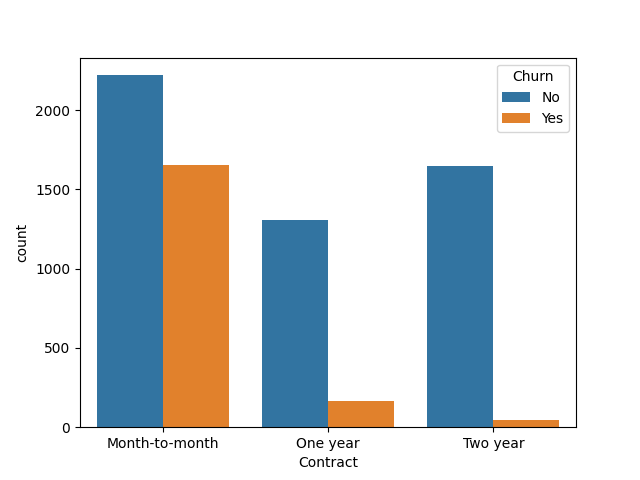
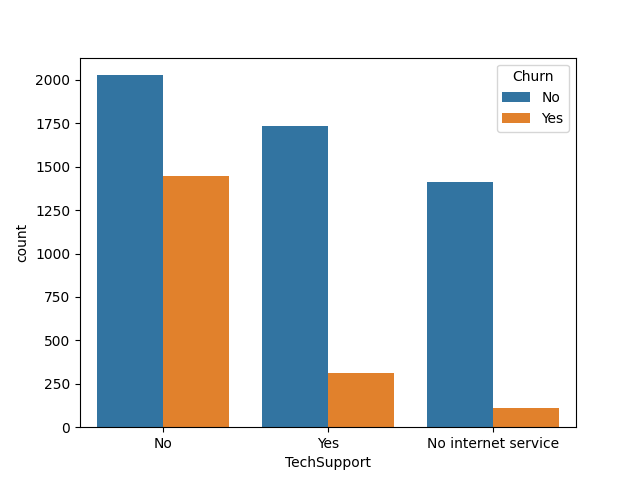
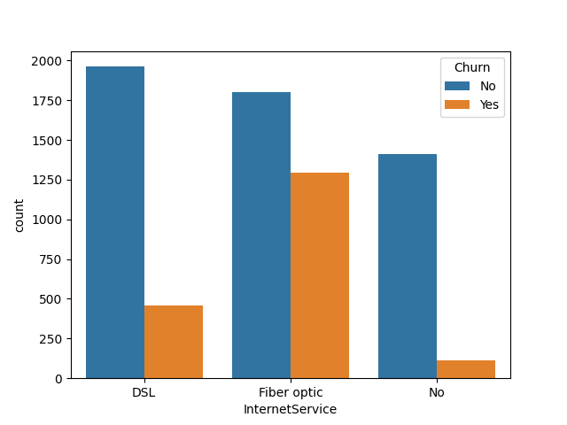
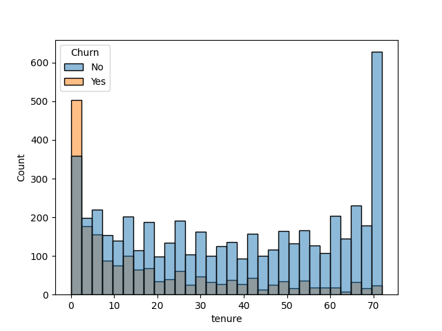
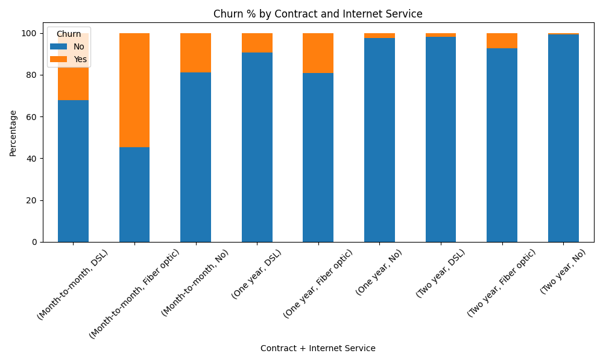

# 📊 Customer Churn Analysis

## 📌 Problem Statement

Customer churn leads to significant revenue loss for telecom companies. Identifying the key factors driving churn is critical to improving customer retention and long-term profitability.

---

## 🎯 Objective

Analyze customer data to:

* Identify patterns and factors influencing churn
* Segment high-risk customers
* Provide actionable business recommendations

---

## 🛠️ Tools & Technologies

* Python
* Pandas
* NumPy
* Matplotlib
* Seaborn
* Jupyter Notebook

---

## 📂 Dataset

* ~7,000 customer records
* Includes demographic, service usage, and billing information
* Target variable: **Churn (Yes/No)**

---

## 🔍 Key Insights

### 🔴 High-Risk Segments

* Customers with **month-to-month contracts** show ~42.7% churn
* Customers using **fiber optic service** have significantly higher churn
* Customers with **high monthly charges** are more likely to churn
* **New customers (low tenure)** have higher churn rates
* **Senior citizens** show ~41.7% churn vs ~23.6% for non-seniors

---

### 🟢 Strong Retention Drivers

* Customers with **TechSupport** have ~15.2% churn vs ~41.6% without
* Customers with **OnlineSecurity** show significantly lower churn
* **Long-term contracts (1–2 years)** drastically reduce churn (~2–11%)

---

### ⚠️ Most Critical Finding

* Customers with **month-to-month contracts + fiber optic service** show the highest churn (~54.6%)
* This segment represents the **highest-risk group** and should be prioritized

---

## 📊 Visual Insights

### Churn by Contract Type



### Churn by Tech Support



### Churn by Internet Service



### Churn by Tenure Group



### Combined Analysis (Contract + Internet)



---

## 💡 Business Recommendations

* 🎯 **Promote long-term contracts**
  Offer discounts or incentives to shift customers from monthly to yearly plans

* 🛠️ **Bundle TechSupport & OnlineSecurity**
  These services significantly reduce churn and improve customer retention

* ⚡ **Improve Fiber Optic Service**
  Investigate pricing, performance, or customer expectations

* 🚀 **Focus on new customers**
  Strengthen onboarding and early engagement strategies

* 👥 **Target high-risk segments**
  Especially month-to-month + fiber users with personalized retention offers

---

## 🧠 Conclusion

Churn is strongly influenced by **contract type, service usage, and pricing**.
By focusing on high-risk segments and improving service offerings, companies can significantly reduce churn and increase customer lifetime value.

---

## 📁 Project Structure

```
customer-churn-analysis/
│
├── data/
├── notebook/
├── images/
└── README.md
```

---

## 🚀 Author

**Dixit**

---
